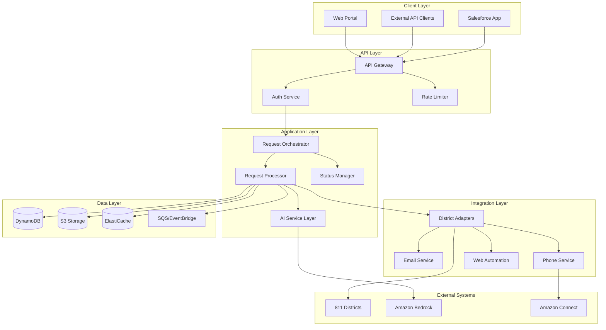

# Technical Requirements Document - 811 Unified Request System

## Table of Contents
1. [System Architecture](#system-architecture)
2. [Technical Stack](#technical-stack)
3. [API Specifications](#api-specifications)
4. [Data Architecture](#data-architecture)
5. [AI/ML Implementation](#aiml-implementation)
6. [Integration Patterns](#integration-patterns)
7. [Security Architecture](#security-architecture)
8. [Performance Engineering](#performance-engineering)
9. [DevOps & Infrastructure](#devops--infrastructure)
10. [Testing Strategy](#testing-strategy)

## 1. System Architecture

### 1.1 High-Level Architecture



### 1.2 Microservices Architecture

```yaml
services:
  api-gateway:
    type: AWS API Gateway
    endpoints:
      - /auth
      - /requests
      - /districts
      - /status
    
  auth-service:
    runtime: Node.js 18
    framework: Express.js
    responsibilities:
      - JWT token generation
      - OAuth 2.0 flow
      - API key validation
      - Salesforce SSO
    
  request-orchestrator:
    runtime: Node.js 18
    framework: NestJS
    responsibilities:
      - Request validation
      - District routing
      - Workflow orchestration
      - Error handling
    
  request-processor:
    runtime: Node.js 18
    framework: NestJS
    responsibilities:
      - Data transformation
      - Submission execution
      - Response parsing
      - Status updates
    
  ai-service:
    runtime: Python 3.11
    framework: FastAPI
    responsibilities:
      - LLama 2 integration
      - Form data extraction
      - Email parsing
      - Phone transcription
    
  district-adapter-service:
    runtime: Node.js 18
    framework: Express.js
    responsibilities:
      - District-specific logic
      - Protocol handling
      - Response normalization
```

## 2. Technical Stack

### 2.1 Core Technologies

```yaml
Backend:
  Language: TypeScript 5.x
  Runtime: Node.js 18 LTS
  Frameworks:
    - NestJS (main application)
    - Express.js (lightweight services)
    - Fastify (high-performance endpoints)
  
Database:
  Primary: DynamoDB
  Cache: Redis (ElastiCache)
  Search: OpenSearch
  File Storage: S3
  
Message Queue:
  Primary: SQS
  Events: EventBridge
  Real-time: WebSockets (API Gateway)
  
AI/ML:
  LLM: LLama 2 via Bedrock
  NLP: Amazon Comprehend
  OCR: Amazon Textract
  Voice: Amazon Connect + Transcribe
  
Automation:
  Web: Playwright
  Email: Nodemailer + IMAP
  Phone: Amazon Connect SDK
  
Monitoring:
  Logs: CloudWatch Logs
  Metrics: CloudWatch Metrics
  Traces: X-Ray
  APM: DataDog
```

### 2.2 Development Tools

```yaml
Development:
  IDE: VS Code
  Linting: ESLint
  Formatting: Prettier
  Git Hooks: Husky
  Commit Convention: Conventional Commits
  
Testing:
  Unit: Jest
  Integration: Supertest
  E2E: Playwright Test
  Load: K6
  
CI/CD:
  Pipeline: GitHub Actions
  IaC: AWS CDK
  Secrets: AWS Secrets Manager
  Artifacts: AWS ECR
```

## 3. API Specifications

### 3.1 RESTful API Design

```typescript
// API Version: v1
// Base URL: https://api.811unified.com/v1

// Authentication Header
headers: {
  'Authorization': 'Bearer {jwt_token}',
  'X-API-Key': '{api_key}',
  'X-Request-ID': '{uuid}'
}

// Request Creation
POST /requests
{
  "workLocation": {
    "address": "123 Main St",
    "city": "New York",
    "state": "NY",
    "zipCode": "10001",
    "latitude": 40.7128,
    "longitude": -74.0060
  },
  "workDetails": {
    "type": "excavation|boring|demolition|other",
    "description": "Installing fiber optic cable",
    "startDate": "2024-01-15T08:00:00Z",
    "duration": 5,
    "depth": 36,
    "area": {
      "length": 100,
      "width": 10,
      "unit": "feet"
    }
  },
  "contact": {
    "name": "John Doe",
    "company": "ABC Construction",
    "phone": "555-123-4567",
    "email": "john@abc.com",
    "alternatePhone": "555-987-6543"
  },
  "excavator": {
    "company": "ABC Construction",
    "address": "456 Business Ave",
    "city": "New York",
    "state": "NY",
    "zipCode": "10002"
  },
  "notifications": {
    "email": true,
    "sms": true,
    "webhook": "https://example.com/webhook"
  },
  "priority": "normal|emergency",
  "metadata": {
    "salesforceId": "a0X1234567890ABC",
    "projectId": "PROJ-2024-001"
  }
}

// Response
{
  "requestId": "req_1234567890",
  "status": "submitted",
  "districtId": "ny_811",
  "ticketNumber": "2024001234",
  "submissionMethod": "api|web|email|phone",
  "estimatedResponseTime": "2024-01-13T16:00:00Z",
  "createdAt": "2024-01-12T10:30:00Z",
  "_links": {
    "self": "/requests/req_1234567890",
    "status": "/requests/req_1234567890/status",
    "documents": "/requests/req_1234567890/documents"
  }
}

// Status Update
GET /requests/{requestId}/status
{
  "requestId": "req_1234567890",
  "currentStatus": "in_progress",
  "lastUpdated": "2024-01-12T14:30:00Z",
  "history": [
    {
      "status": "submitted",
      "timestamp": "2024-01-12T10:30:00Z",
      "details": "Request submitted to NY 811"
    },
    {
      "status": "acknowledged",
      "timestamp": "2024-01-12T10:45:00Z",
      "details": "Request acknowledged by district"
    },
    {
      "status": "in_progress",
      "timestamp": "2024-01-12T14:30:00Z",
      "details": "Utilities notified"
    }
  ],
  "utilities": [
    {
      "name": "Con Edison",
      "status": "clear",
      "responseDate": "2024-01-12T13:00:00Z",
      "notes": "No facilities in area"
    },
    {
      "name": "National Grid",
      "status": "marked",
      "responseDate": "2024-01-12T14:00:00Z",
      "notes": "Gas lines marked with yellow flags"
    }
  ]
}

// District Information
GET /districts
{
  "districts": [
    {
      "id": "ny_811",
      "name": "New York 811",
      "states": ["NY"],
      "submissionMethods": ["api", "web", "phone", "email"],
      "requirements": {
        "leadTime": 72,
        "emergencyAvailable": true,
        "maxDuration": 30,
        "renewalRequired": true
      },
      "endpoints": {
        "web": "https://newyork-811.com",
        "api": "https://api.newyork-811.com",
        "email": "tickets@newyork-811.com"
      }
    }
  ]
}
```

### 3.2 GraphQL Alternative

```graphql
type Query {
  request(id: ID!): Request
  requests(filter: RequestFilter, pagination: Pagination): RequestConnection
  district(id: ID!): District
  districts(state: String): [District!]!
}

type Mutation {
  createRequest(input: CreateRequestInput!): Request!
  updateRequest(id: ID!, input: UpdateRequestInput!): Request!
  cancelRequest(id: ID!, reason: String!): Request!
}

type Subscription {
  requestStatusChanged(requestId: ID!): RequestStatus!
}

type Request {
  id: ID!
  ticketNumber: String
  district: District!
  workLocation: Location!
  workDetails: WorkDetails!
  status: RequestStatus!
  utilities: [UtilityResponse!]!
  createdAt: DateTime!
  updatedAt: DateTime!
}
```

## 4. Data Architecture

### 4.1 DynamoDB Schema

```yaml
Tables:
  Requests:
    PartitionKey: requestId
    SortKey: version
    Attributes:
      - requestId: String
      - version: Number
      - districtId: String
      - status: String
      - ticketNumber: String
      - workLocation: Map
      - workDetails: Map
      - contact: Map
      - excavator: Map
      - submissionMethod: String
      - createdAt: String
      - updatedAt: String
      - ttl: Number
    GSI:
      - GSI1:
          PartitionKey: districtId
          SortKey: createdAt
      - GSI2:
          PartitionKey: status
          SortKey: updatedAt
      - GSI3:
          PartitionKey: salesforceId
          SortKey: createdAt
  
  Districts:
    PartitionKey: districtId
    Attributes:
      - districtId: String
      - name: String
      - states: List
      - submissionMethods: List
      - requirements: Map
      - endpoints: Map
      - configuration: Map
      - active: Boolean
  
  StatusUpdates:
    PartitionKey: requestId
    SortKey: timestamp
    Attributes:
      - requestId: String
      - timestamp: String
      - status: String
      - details: String
      - source: String
      - utilities: List
  
  AuditLog:
    PartitionKey: date
    SortKey: timestamp#requestId
    Attributes:
      - action: String
      - userId: String
      - requestId: String
      - changes: Map
      - ipAddress: String
```

### 4.2 Caching Strategy

```yaml
Redis Cache Structure:
  # Request Cache (TTL: 5 minutes)
  request:{requestId}:
    - Full request object
    - Status information
    - Recent updates
  
  # District Cache (TTL: 1 hour)
  district:{districtId}:
    - District configuration
    - Submission endpoints
    - Requirements
  
  # User Session (TTL: 30 minutes)
  session:{sessionId}:
    - User information
    - Permissions
    - Recent requests
  
  # Rate Limiting (TTL: 1 minute)
  rate:{apiKey}:{minute}:
    - Request count
    - Quota remaining
```

## 5. AI/ML Implementation

### 5.1 LLama 2 Integration

```typescript
// AI Service Interface
interface AIService {
  // Web form automation
  async extractFormFields(html: string): Promise<FormFieldMap>;
  async generateFormSubmission(fields: FormFieldMap, data: RequestData): Promise<FormSubmission>;
  
  // Email processing
  async parseEmailResponse(email: EmailMessage): Promise<{
    ticketNumber?: string;
    status?: string;
    utilities?: UtilityResponse[];
    nextSteps?: string;
  }>;
  
  // Phone automation
  async generatePhoneScript(request: RequestData): Promise<PhoneScript>;
  async transcribePhoneResponse(audio: Buffer): Promise<{
    transcript: string;
    entities: ExtractedEntities;
  }>;
}

// Implementation
class LlamaAIService implements AIService {
  private bedrock: BedrockClient;
  
  async extractFormFields(html: string): Promise<FormFieldMap> {
    const prompt = `
      Extract all form fields from the following HTML.
      Identify field names, types, required status, and validation rules.
      HTML: ${html}
      
      Return as JSON with structure:
      {
        "fields": [
          {
            "name": "field_name",
            "type": "text|select|checkbox|etc",
            "required": boolean,
            "options": [],
            "validation": {}
          }
        ]
      }
    `;
    
    const response = await this.bedrock.invoke({
      modelId: 'meta.llama2-70b-chat-v1',
      body: { prompt, max_tokens: 2000 }
    });
    
    return JSON.parse(response.body);
  }
}
```

### 5.2 Pattern Learning System

```typescript
// Pattern Recognition for Optimization
interface PatternLearning {
  // Learn from successful submissions
  async recordSubmission(
    districtId: string,
    method: string,
    requestData: any,
    responseData: any,
    success: boolean,
    duration: number
  ): Promise<void>;
  
  // Get optimized submission strategy
  async getOptimalStrategy(
    districtId: string,
    requestData: any
  ): Promise<{
    method: string;
    transformations: DataTransformation[];
    confidence: number;
  }>;
}

// Machine Learning Pipeline
class MLPipeline {
  async trainDistrictModel(districtId: string) {
    // 1. Collect historical data
    const submissions = await this.getHistoricalSubmissions(districtId);
    
    // 2. Feature extraction
    const features = this.extractFeatures(submissions);
    
    // 3. Train model
    const model = await this.trainModel(features);
    
    // 4. Deploy model
    await this.deployModel(districtId, model);
  }
}
```

## 6. Integration Patterns

### 6.1 District Adapter Pattern

```typescript
// Base adapter interface
abstract class DistrictAdapter {
  abstract async submitRequest(request: UnifiedRequest): Promise<SubmissionResult>;
  abstract async getStatus(ticketNumber: string): Promise<StatusResult>;
  abstract async parseResponse(response: any): Promise<ParsedResponse>;
}

// Web form adapter
class WebFormAdapter extends DistrictAdapter {
  private browser: Browser;
  
  async submitRequest(request: UnifiedRequest): Promise<SubmissionResult> {
    const page = await this.browser.newPage();
    
    try {
      // Navigate to form
      await page.goto(this.district.endpoints.web);
      
      // AI-powered form filling
      const formFields = await this.aiService.extractFormFields(
        await page.content()
      );
      
      const formData = await this.aiService.mapRequestToForm(
        request,
        formFields
      );
      
      // Fill form
      for (const [field, value] of Object.entries(formData)) {
        await page.fill(`[name="${field}"]`, value);
      }
      
      // Submit
      await page.click('[type="submit"]');
      
      // Extract confirmation
      const confirmation = await this.extractConfirmation(page);
      
      return {
        success: true,
        ticketNumber: confirmation.ticketNumber,
        method: 'web'
      };
    } finally {
      await page.close();
    }
  }
}

// API adapter
class APIAdapter extends DistrictAdapter {
  async submitRequest(request: UnifiedRequest): Promise<SubmissionResult> {
    const districtRequest = this.transformRequest(request);
    
    const response = await this.httpClient.post(
      this.district.endpoints.api,
      districtRequest,
      {
        headers: this.getAuthHeaders(),
        timeout: 30000,
        retry: {
          limit: 3,
          methods: ['POST'],
          statusCodes: [408, 429, 500, 502, 503, 504]
        }
      }
    );
    
    return this.parseResponse(response.data);
  }
}
```

### 6.2 Email Integration

```typescript
class EmailAdapter extends DistrictAdapter {
  private emailService: EmailService;
  
  async submitRequest(request: UnifiedRequest): Promise<SubmissionResult> {
    // Generate email content
    const emailContent = await this.generateEmailContent(request);
    
    // Send email
    const messageId = await this.emailService.send({
      to: this.district.endpoints.email,
      subject: this.generateSubject(request),
      body: emailContent,
      attachments: await this.prepareAttachments(request)
    });
    
    // Set up response listener
    await this.emailService.watchForResponse(
      messageId,
      async (response) => {
        const parsed = await this.aiService.parseEmailResponse(response);
        await this.updateRequestStatus(request.id, parsed);
      }
    );
    
    return {
      success: true,
      method: 'email',
      trackingId: messageId
    };
  }
}
```

## 7. Security Architecture

### 7.1 Authentication & Authorization

```yaml
Authentication Flow:
  1. Salesforce SSO:
     - OAuth 2.0 flow
     - JWT token generation
     - Session management
  
  2. API Key Authentication:
     - HMAC signature validation
     - Rate limiting per key
     - IP whitelisting
  
  3. Service-to-Service:
     - mTLS certificates
     - AWS IAM roles
     - Temporary credentials

Authorization Model:
  Roles:
    - admin: Full system access
    - operator: Submit and manage requests
    - viewer: Read-only access
    - api_user: API access only
  
  Permissions:
    - request:create
    - request:read
    - request:update
    - request:delete
    - district:manage
    - system:configure
```

### 7.2 Data Encryption

```yaml
Encryption at Rest:
  - DynamoDB: AWS managed encryption (AES-256)
  - S3: SSE-S3 with bucket policies
  - ElastiCache: Redis AUTH + TLS
  
Encryption in Transit:
  - TLS 1.3 minimum
  - Certificate pinning for critical endpoints
  - Perfect Forward Secrecy (PFS)
  
Field-Level Encryption:
  - PII fields: AES-256-GCM
  - API keys: Argon2id hashing
  - Sensitive metadata: AWS KMS
```

## 8. Performance Engineering

### 8.1 Performance Targets

```yaml
Response Time SLAs:
  - API Gateway latency: < 50ms
  - Synchronous operations: < 200ms
  - Database queries: < 100ms
  - Cache hits: < 10ms
  - AI processing: < 2s
  
Throughput Requirements:
  - Requests per second: 1000
  - Concurrent submissions: 500
  - WebSocket connections: 10,000
  - Background jobs: 1000/minute
  
Availability:
  - Uptime SLA: 99.95%
  - RTO: 15 minutes
  - RPO: 5 minutes
  - Disaster recovery: Multi-region
```

### 8.2 Optimization Strategies

```typescript
// Connection pooling
const dbPool = new DynamoDBPool({
  maxConnections: 100,
  minConnections: 10,
  idleTimeout: 300000,
  acquireTimeout: 10000
});

// Request batching
class RequestBatcher {
  private batch: Map<string, Request[]> = new Map();
  private timer: NodeJS.Timeout;
  
  async addRequest(districtId: string, request: Request) {
    if (!this.batch.has(districtId)) {
      this.batch.set(districtId, []);
    }
    
    this.batch.get(districtId).push(request);
    
    if (this.batch.get(districtId).length >= 10) {
      await this.flush(districtId);
    } else {
      this.scheduleFlush();
    }
  }
  
  private scheduleFlush() {
    clearTimeout(this.timer);
    this.timer = setTimeout(() => this.flushAll(), 1000);
  }
}

// Circuit breaker pattern
class CircuitBreaker {
  private failures = 0;
  private lastFailure: Date;
  private state: 'closed' | 'open' | 'half-open' = 'closed';
  
  async execute<T>(fn: () => Promise<T>): Promise<T> {
    if (this.state === 'open') {
      if (Date.now() - this.lastFailure.getTime() > 60000) {
        this.state = 'half-open';
      } else {
        throw new Error('Circuit breaker is open');
      }
    }
    
    try {
      const result = await fn();
      if (this.state === 'half-open') {
        this.state = 'closed';
        this.failures = 0;
      }
      return result;
    } catch (error) {
      this.failures++;
      this.lastFailure = new Date();
      
      if (this.failures >= 5) {
        this.state = 'open';
      }
      
      throw error;
    }
  }
}
```

## 9. DevOps & Infrastructure

### 9.1 Infrastructure as Code

```typescript
// AWS CDK Stack
import * as cdk from 'aws-cdk-lib';

export class UnifiedRequestStack extends cdk.Stack {
  constructor(scope: Construct, id: string, props?: cdk.StackProps) {
    super(scope, id, props);
    
    // VPC
    const vpc = new ec2.Vpc(this, 'UnifiedRequestVPC', {
      maxAzs: 3,
      natGateways: 2
    });
    
    // API Gateway
    const api = new apigateway.RestApi(this, 'UnifiedRequestAPI', {
      restApiName: '811-unified-api',
      deployOptions: {
        stageName: 'prod',
        tracingEnabled: true,
        dataTraceEnabled: true,
        loggingLevel: apigateway.MethodLoggingLevel.INFO
      }
    });
    
    // Lambda Functions
    const requestHandler = new lambda.Function(this, 'RequestHandler', {
      runtime: lambda.Runtime.NODEJS_18_X,
      handler: 'index.handler',
      code: lambda.Code.fromAsset('dist'),
      environment: {
        TABLE_NAME: requestTable.tableName
      },
      tracing: lambda.Tracing.ACTIVE
    });
    
    // DynamoDB
    const requestTable = new dynamodb.Table(this, 'RequestTable', {
      partitionKey: { name: 'requestId', type: dynamodb.AttributeType.STRING },
      sortKey: { name: 'version', type: dynamodb.AttributeType.NUMBER },
      billingMode: dynamodb.BillingMode.PAY_PER_REQUEST,
      pointInTimeRecovery: true,
      encryption: dynamodb.TableEncryption.AWS_MANAGED
    });
    
    // SQS Queues
    const submissionQueue = new sqs.Queue(this, 'SubmissionQueue', {
      visibilityTimeout: cdk.Duration.minutes(15),
      deadLetterQueue: {
        queue: new sqs.Queue(this, 'SubmissionDLQ'),
        maxReceiveCount: 3
      }
    });
  }
}
```

### 9.2 CI/CD Pipeline

```yaml
# GitHub Actions Workflow
name: Deploy 811 Unified System

on:
  push:
    branches: [main, develop]
  pull_request:
    branches: [main]

jobs:
  test:
    runs-on: ubuntu-latest
    steps:
      - uses: actions/checkout@v3
      
      - name: Setup Node.js
        uses: actions/setup-node@v3
        with:
          node-version: '18'
          cache: 'npm'
      
      - name: Install dependencies
        run: npm ci
      
      - name: Run linting
        run: npm run lint
      
      - name: Run unit tests
        run: npm run test:unit
      
      - name: Run integration tests
        run: npm run test:integration
      
      - name: SonarCloud scan
        uses: SonarSource/sonarcloud-github-action@master
        env:
          GITHUB_TOKEN: ${{ secrets.GITHUB_TOKEN }}
          SONAR_TOKEN: ${{ secrets.SONAR_TOKEN }}
  
  build:
    needs: test
    runs-on: ubuntu-latest
    steps:
      - name: Build application
        run: npm run build
      
      - name: Build Docker image
        run: |
          docker build -t 811-unified:${{ github.sha }} .
          docker tag 811-unified:${{ github.sha }} 811-unified:latest
      
      - name: Push to ECR
        env:
          AWS_REGION: us-east-1
        run: |
          aws ecr get-login-password --region $AWS_REGION | \
            docker login --username AWS --password-stdin $ECR_REGISTRY
          docker push $ECR_REGISTRY/811-unified:${{ github.sha }}
  
  deploy:
    needs: build
    runs-on: ubuntu-latest
    if: github.ref == 'refs/heads/main'
    steps:
      - name: Deploy to AWS
        run: |
          npm run cdk deploy -- \
            --require-approval never \
            --context imageTag=${{ github.sha }}
```

## 10. Testing Strategy

### 10.1 Test Pyramid

```yaml
Unit Tests (70%):
  - Service logic
  - Data transformations
  - Utility functions
  - Validation rules
  Coverage target: 90%

Integration Tests (20%):
  - API endpoints
  - Database operations
  - External service mocks
  - Message queue processing

E2E Tests (10%):
  - Critical user journeys
  - District submissions
  - Status updates
  - Salesforce integration
```

### 10.2 Test Implementation

```typescript
// Unit test example
describe('RequestProcessor', () => {
  let processor: RequestProcessor;
  let mockDb: jest.Mocked<DynamoDBClient>;
  let mockAI: jest.Mocked<AIService>;
  
  beforeEach(() => {
    mockDb = createMockDb();
    mockAI = createMockAI();
    processor = new RequestProcessor(mockDb, mockAI);
  });
  
  describe('processRequest', () => {
    it('should route request to correct district', async () => {
      const request = createTestRequest({
        workLocation: { state: 'NY' }
      });
      
      const result = await processor.processRequest(request);
      
      expect(result.districtId).toBe('ny_811');
      expect(mockDb.put).toHaveBeenCalledWith(
        expect.objectContaining({
          requestId: request.id,
          districtId: 'ny_811'
        })
      );
    });
    
    it('should handle district API failure', async () => {
      mockAI.submitToDistrict.mockRejectedValue(
        new Error('District API unavailable')
      );
      
      const request = createTestRequest();
      const result = await processor.processRequest(request);
      
      expect(result.status).toBe('pending_retry');
      expect(result.submissionMethod).toBe('fallback');
    });
  });
});

// Integration test example
describe('API Integration', () => {
  let app: INestApplication;
  
  beforeAll(async () => {
    const moduleFixture = await Test.createTestingModule({
      imports: [AppModule]
    }).compile();
    
    app = moduleFixture.createNestApplication();
    await app.init();
  });
  
  describe('POST /requests', () => {
    it('should create request and return 201', async () => {
      const response = await request(app.getHttpServer())
        .post('/requests')
        .set('Authorization', 'Bearer test-token')
        .send(validRequestPayload)
        .expect(201);
      
      expect(response.body).toMatchObject({
        requestId: expect.any(String),
        status: 'submitted',
        ticketNumber: expect.any(String)
      });
    });
  });
});

// E2E test example
test('Complete request submission flow', async ({ page }) => {
  // Login to Salesforce
  await page.goto('https://test.salesforce.com');
  await page.fill('#username', 'test@example.com');
  await page.fill('#password', 'password');
  await page.click('#Login');
  
  // Navigate to 811 app
  await page.click('text=811 Requests');
  
  // Create new request
  await page.click('button:has-text("New Request")');
  await page.fill('#address', '123 Main St');
  await page.selectOption('#state', 'NY');
  await page.fill('#workDescription', 'Installing fiber optic cable');
  
  // Submit request
  await page.click('button:has-text("Submit")');
  
  // Verify confirmation
  await expect(page.locator('.confirmation')).toContainText('Request submitted successfully');
  await expect(page.locator('.ticket-number')).toBeVisible();
});
```

### 10.3 Load Testing

```javascript
// K6 Load Test Script
import http from 'k6/http';
import { check, sleep } from 'k6';

export const options = {
  stages: [
    { duration: '2m', target: 100 },
    { duration: '5m', target: 500 },
    { duration: '2m', target: 1000 },
    { duration: '5m', target: 1000 },
    { duration: '2m', target: 0 },
  ],
  thresholds: {
    http_req_duration: ['p(95)<500'],
    http_req_failed: ['rate<0.1'],
  },
};

export default function () {
  const payload = JSON.stringify({
    workLocation: {
      address: '123 Main St',
      city: 'New York',
      state: 'NY',
      zipCode: '10001'
    },
    workDetails: {
      type: 'excavation',
      startDate: '2024-01-15T08:00:00Z',
      duration: 5
    },
    contact: {
      name: 'Test User',
      phone: '555-123-4567',
      email: 'test@example.com'
    }
  });
  
  const params = {
    headers: {
      'Content-Type': 'application/json',
      'Authorization': 'Bearer test-token',
    },
  };
  
  const response = http.post(
    'https://api.811unified.com/v1/requests',
    payload,
    params
  );
  
  check(response, {
    'status is 201': (r) => r.status === 201,
    'response has requestId': (r) => JSON.parse(r.body).requestId !== undefined,
    'response time < 500ms': (r) => r.timings.duration < 500,
  });
  
  sleep(1);
}
```

## Appendices

### A. Error Codes

```yaml
API Error Codes:
  400-001: Invalid request format
  400-002: Missing required field
  400-003: Invalid date format
  401-001: Invalid authentication token
  401-002: Expired token
  403-001: Insufficient permissions
  404-001: Request not found
  404-002: District not found
  409-001: Duplicate request
  422-001: Invalid work location
  422-002: Work date in the past
  429-001: Rate limit exceeded
  500-001: Internal server error
  502-001: District service unavailable
  503-001: Service temporarily unavailable
  504-001: District service timeout
```

### B. Monitoring Alerts

```yaml
Critical Alerts:
  - API availability < 99.5%
  - Error rate > 5%
  - Response time p95 > 1s
  - DLQ messages > 100
  - Database throttling
  
Warning Alerts:
  - API availability < 99.9%
  - Error rate > 2%
  - Response time p95 > 500ms
  - Queue depth > 1000
  - Memory usage > 80%
```

### C. Compliance Checklist

```yaml
Security Compliance:
  ✓ SOC 2 Type II
  ✓ PCI DSS (if handling payments)
  ✓ HIPAA (if handling health data)
  ✓ State privacy laws (CCPA, etc.)
  
811 Compliance:
  ✓ Positive response system
  ✓ Ticket retention (7 years)
  ✓ Emergency request handling
  ✓ Update notifications
  
Data Governance:
  ✓ Data classification
  ✓ Retention policies
  ✓ Access controls
  ✓ Audit logging
```